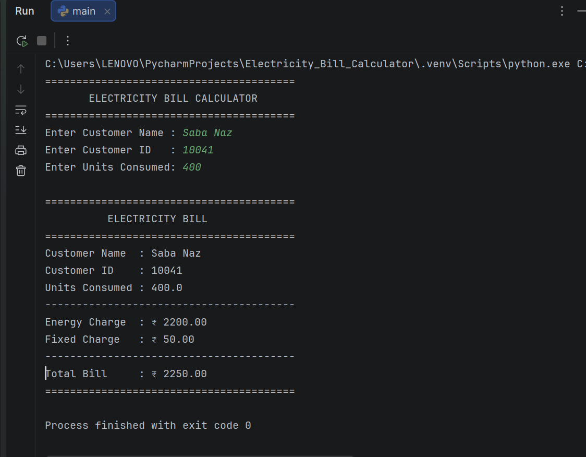
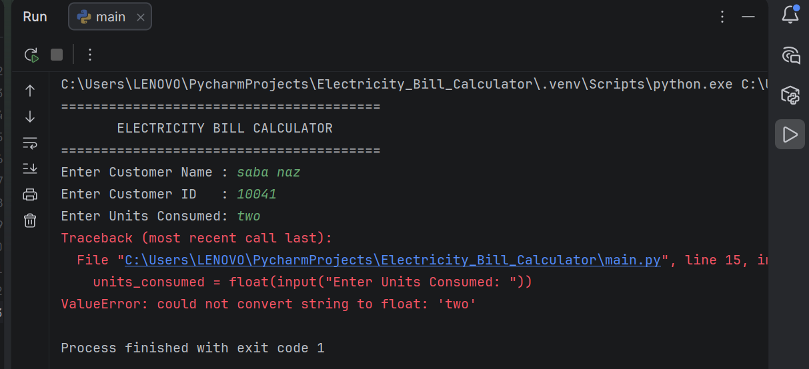

# Electricity Bill Calculator

A simple Python project that calculates an electricity bill based on the number of units consumed.

## About the Project

This project was developed as a basic Python application for the **Python Essential** course. The main purpose of the project is to practice classes, objects, methods, conditional statements, user input, and modular programming.

The program takes the following information from the user:

- Customer Name
- Customer ID
- Units Consumed

It then calculates:

- Energy Charge
- Fixed Charge
- Total Bill

The project is intentionally kept simple and runs in the terminal. It does not use a database, GUI, online payment system, or internet connection.

## Electricity Rate Used

The following rates are used for this academic project:

| Units Consumed | Rate |
|---|---:|
| First 100 units | ₹3 per unit |
| 101–200 units | ₹5 per unit |
| Above 200 units | ₹7 per unit |
| Fixed Charge | ₹50 |

**Note:** These are demonstration rates for the project and are not intended to represent the current tariff of a particular electricity provider.

## Project Structure

```text
Electricity_Bill_Calculator_Simple/
│
├── main.py
├── customer.py
├── units.py
├── energy_charge.py
├── fixed_charge.py
├── bill.py
├── README.md
└── PROJECT_STATEMENT.md

##SCREENSHOTS


##VALIDATION TEST

